# Как работает драйвер отпечатка Goodix GM168 — простым языком

> Схема для тех, кто хочет понять что происходит, когда ты прикладываешь палец к сенсору на ноутбуке.

---

## 🗺️ Общая картина

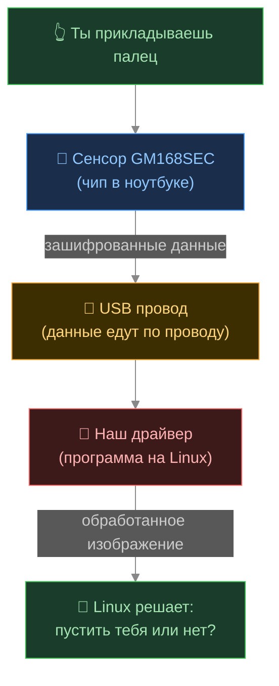

**Коротко:** сенсор снимает отпечаток → шифрует → отправляет по USB → драйвер расшифровывает и обрабатывает → Linux сравнивает и пускает тебя.

---

## 🔑 Шаг 0: Секретный ключ (делается один раз)

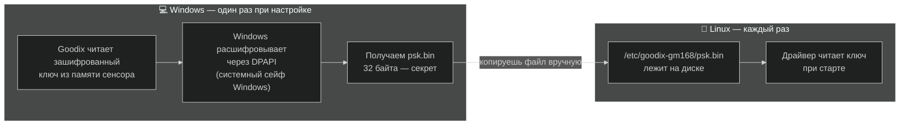

> ⚠️ **Почему так сложно?** Ключ намертво привязан к Windows-установке через DPAPI (это как сейф, открыть который может только та самая Windows). Поэтому надо один раз загрузиться в Windows, вытащить ключ и скопировать на Linux.

---

## 🚀 Шаг 1: Инициализация (драйвер запускается)

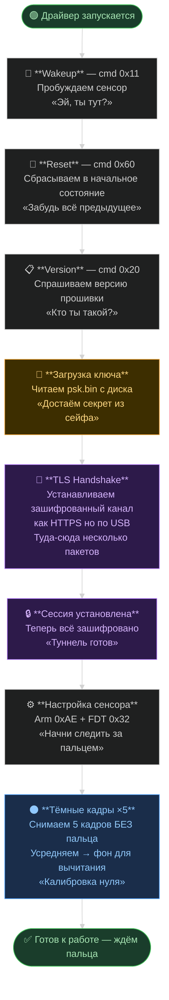

> 💡 **Тёмные кадры** — это как фотоаппарат, который сначала снимает с закрытым объективом, чтобы знать какой «шум» есть у матрицы. Потом это вычитается из реального снимка.

---

## 👁️ Шаг 2: Ожидание пальца

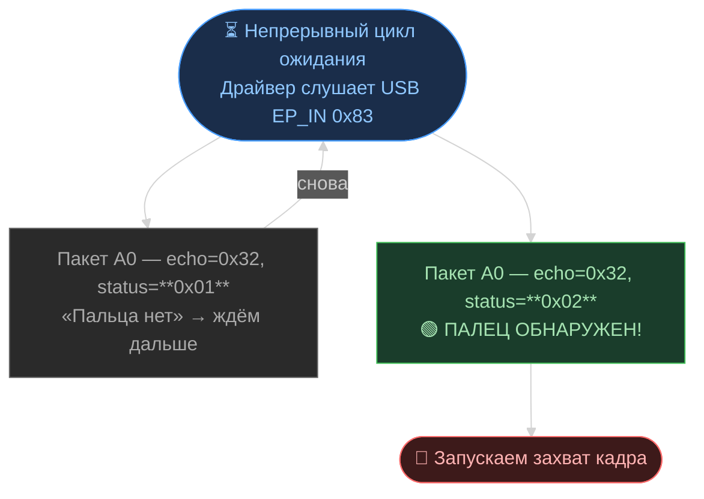

> 💡 Сенсор сам следит за касанием (ёмкостный датчик). Когда палец касается — электрическое поле меняется → сенсор кричит «ЕСТЬ!»

---

## 📸 Шаг 3: Захват изображения

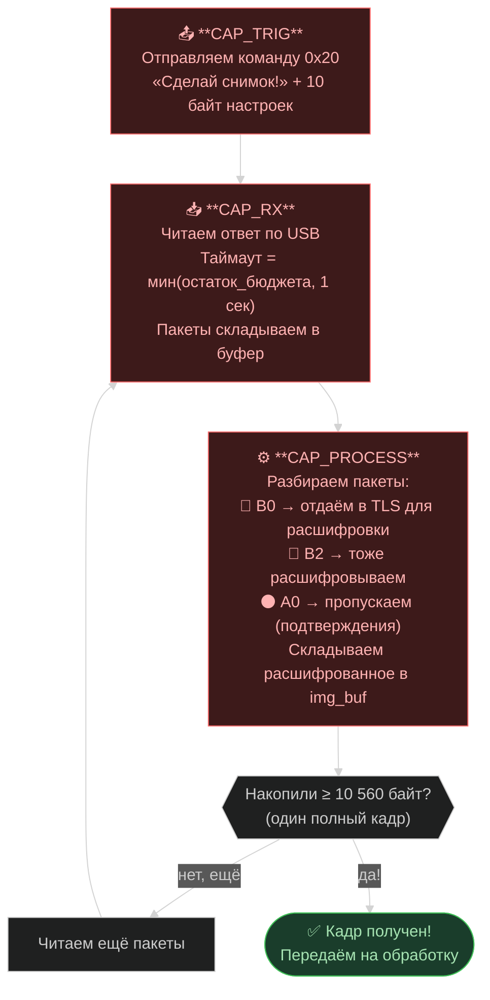

> 💡 **Почему 10 560 байт?** 80 строк × 132 байта = 10 560. Данные приходят кусками по USB, поэтому мы их склеиваем пока не получим полный кадр.

---

## 🔐 Как работает шифрование

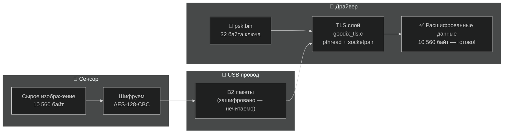

> 💡 **TLS** — тот же протокол что защищает HTTPS в браузере. Только здесь он работает по USB, а не по сети. **PSK** (Pre-Shared Key) — общий секрет, который знают и сенсор и драйвер.

---

## 🖼️ Шаг 4: Обработка изображения — 6 этапов

```mermaid
%%{init: {'theme': 'dark'}}%%
flowchart TD
    RAW(["📊 Сырые данные\n10 560 байт — 80×132"])

    D1["1️⃣ **decode_frame()**\nРаспаковка 12-бит → 16-бит\nУбираем служебные байты (36 на строку)\nТранспонируем → **64×80** пикселей\nРезультат: raw16 — 5 120 чисел"]

    D2["2️⃣ **bg_subtract()**\nВычитаем тёмный фон (снятый при старте)\nПотом **median 3×3** — убираем одиночные\nбитые пиксели (мусорные точки)"]

    D3["3️⃣ **binomial3x3()**\nГауссово размытие 3×3\nМатрица: 1 2 1 / 2 4 2 / 1 2 1 ÷ 16\nСглаживаем мелкий шум сенсора"]

    D4["4️⃣ **envelope_h() + envelope_v()**\nДля каждого пикселя — окно **11×11**\nНаходим самый тёмный (low) и светлый (high)\nсосед — «огибающая» локального контраста"]

    D5["5️⃣ **morph_close_x5()**\nМорфологическое закрытие X-формой\nЗаполняем дырки в папиллярных линиях\n5 проходов для надёжности"]

    D6["6️⃣ **local_stretch()**\nout = **255 − (px − low) × 255 / (high − low)**\nКаждый пиксель растягивается на 0..255\nИнвертируем полярность (NBIS требует)"]

    DONE(["✅ uint8[5120] — 64×80 пикселей\nГотово для распознавания"])

    RAW --> D1 --> D2 --> D3 --> D4 --> D5 --> D6 --> DONE

    style RAW fill:#2a2a2a,stroke:#666,color:#ccc
    style D1 fill:#1a2040,stroke:#5c7cfa,color:#a0b4ff
    style D2 fill:#1a2040,stroke:#5c7cfa,color:#a0b4ff
    style D3 fill:#1a2040,stroke:#5c7cfa,color:#a0b4ff
    style D4 fill:#1a2040,stroke:#5c7cfa,color:#a0b4ff
    style D5 fill:#1a2040,stroke:#5c7cfa,color:#a0b4ff
    style D6 fill:#1a2040,stroke:#5c7cfa,color:#a0b4ff
    style DONE fill:#1a3d2b,stroke:#40c057,color:#a6e3b2
```

> 💡 **Зачем столько шагов?** Сенсор ёмкостный, не оптический — он снимает не фото, а электрическое поле. Сигнал слабый и зашумлённый, поэтому нужна вся эта цепочка фильтров чтобы получить чёткие линии отпечатка.

---

## 🎯 Шаг 5: Контроль качества и повторы

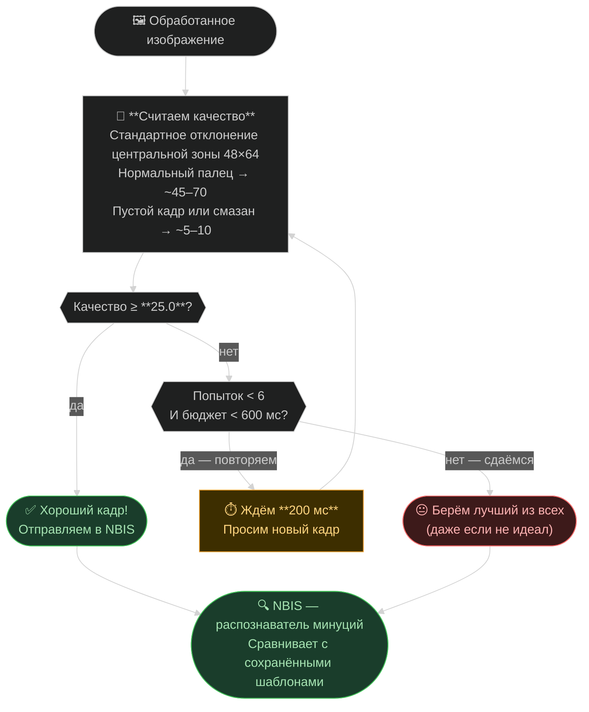

> 💡 **Зачем повторы?** Если ты приложил палец криво или влажный — первый кадр будет плохим. Система делает до 6 попыток за 600 мс чтобы поймать хороший момент. Так улучшается точность на ~20%.

---

## 🔄 Шаг 6: Перезарядка сенсора

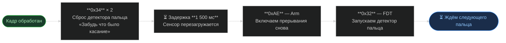

> 💡 Без этого шага сенсор думает что палец всё ещё лежит и не отреагирует на следующее касание.

---

## 🔐 Финал: Распознавание отпечатка

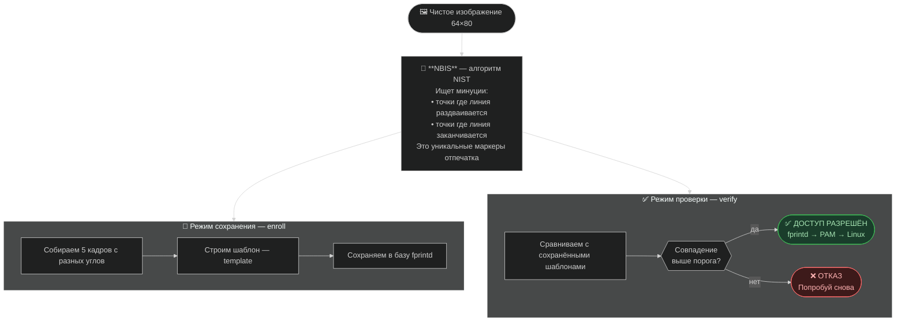

---

## 🛡️ Защита от сбоев (10 механизмов)

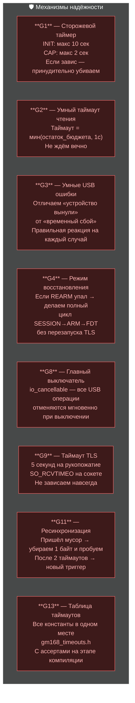

---

## 📁 Файлы проекта

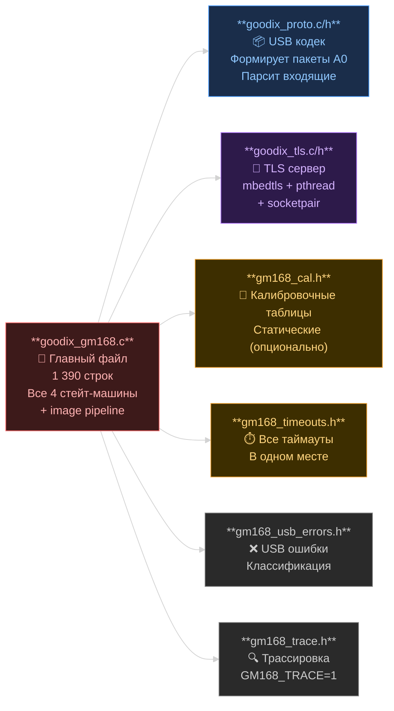

---

## 🌊 Полный поток — вся жизнь одного касания

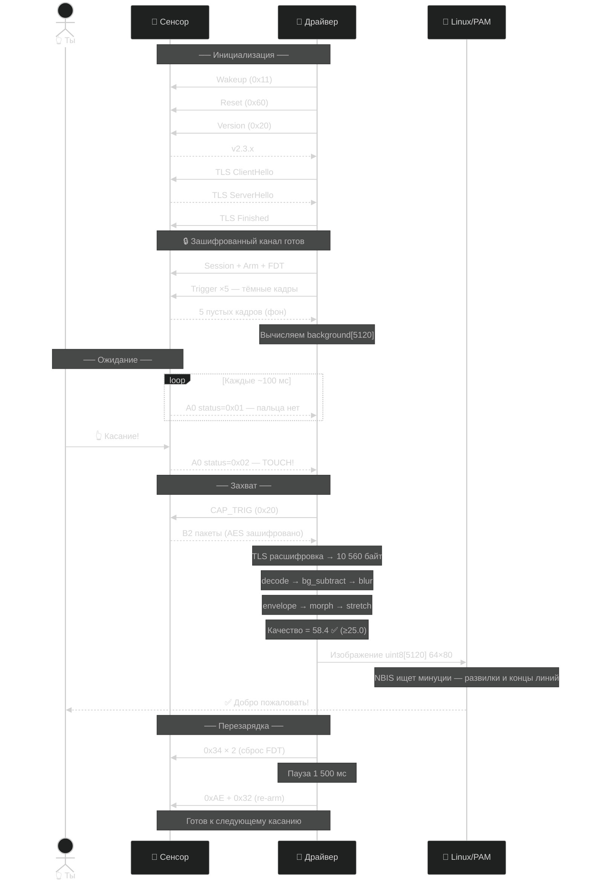

---

## 📊 Ключевые числа

| Параметр | Значение | Пояснение |
|---|---|---|
| Размер сенсора | **64 × 80 пикселей** | Маленький, но достаточный для минуций |
| Размер кадра по USB | **10 560 байт** | 80 строк × 132 байта |
| Глубина пикселя | **12 бит** (0–4095) | Высокая точность измерения |
| Тёмных кадров для калибровки | **×5** | Усредняем для точного фона |
| Порог качества | **≥ 25.0** | Нормальный палец даёт ~45–70 |
| Макс. попыток на касание | **6** | Даём шанс плохому кадру исправиться |
| Бюджет времени на касание | **600 мс** | После — берём лучшее из имеющегося |
| Задержка между повторами | **200 мс** | Палец успевает стабилизироваться |
| Размер PSK ключа | **32 байта = 256 бит** | Военный уровень шифрования |
| Таймаут TLS рукопожатия | **5 секунд** | Дольше — считаем сенсор мёртвым |
| Таймаут INIT SSM | **10 секунд** | Вся инициализация должна уложиться |
| Таймаут REARM SSM | **4 секунды** | Перезарядка сенсора |
